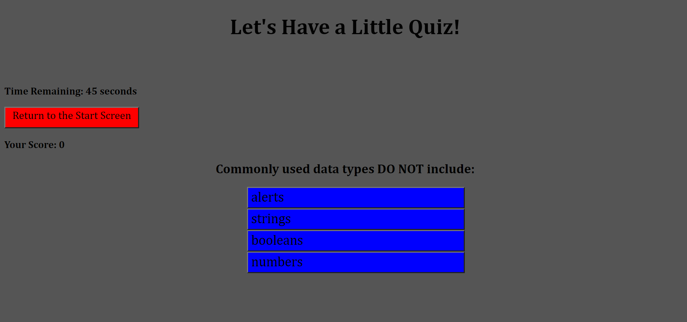

# Multiple Choice Quiz Utilizing JavaScript and Web API Functionality

## Purpose
To allow the user to quiz their knowledge of basic web development and to try to beat their high score.

## Built With
* JavaScript
* HTML
* CSS

## Deployed Link
https://theprattler.github.io/perennial-panda-parade/

## App Preview
